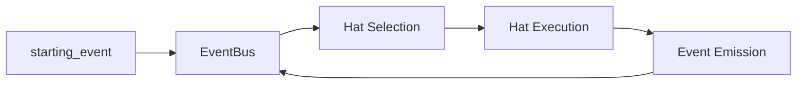

# Advanced Topics

Deep dives into Ulf's internals and advanced usage patterns.

## In This Section

| Topic | Description |
|-------|-------------|
| [Architecture](architecture.md) | System design and crate structure |
| [Creating Custom Hats](custom-hats.md) | Design and implement custom hats |
| [Event System Design](event-system.md) | How events route between hats |
| [Memory System](memory-system.md) | Persistent learning mechanics |
| [Task System](task-system.md) | Runtime work tracking |
| [Testing & Validation](testing.md) | Smoke tests, E2E tests, TUI validation |
| [Diagnostics](diagnostics.md) | Debug with full visibility |
| [Parallel Loops](parallel-loops.md) | Run multiple loops concurrently with worktrees |
| [Agent Waves](agent-waves.md) | Intra-loop parallelism for scatter-gather workflows |

## When to Read This

These guides are for you if:

- You're building complex multi-hat workflows
- You want to understand how Ulf works internally
- You're contributing to Ulf development
- You need to debug tricky issues
- You're extending Ulf with custom backends

## Key Concepts

### Crate Architecture

Ulf is organized as a Cargo workspace:

```
ulf-orchestrator/
├── crates/
│   ├── ulf-proto/     # Protocol types
│   ├── ulf-core/      # Orchestration engine
│   ├── ulf-adapters/  # CLI backends
│   ├── ulf-telegram/  # Telegram bot for human-in-the-loop
│   ├── ulf-tui/       # Terminal UI
│   ├── ulf-cli/       # Binary entry point
│   ├── ulf-e2e/       # End-to-end testing
│   └── ulf-bench/     # Benchmarking
```

### Event Flow

Events are the nervous system of hat-based Ulf:



### State Management

Ulf uses files for all persistent state:

| File | Purpose |
|------|---------|
| `.agent/memories.md` | Cross-session learning |
| `.agent/tasks.jsonl` | Runtime work tracking |
| `.agent/event_history.jsonl` | Event audit log |
| `.agent/scratchpad.md` | Iteration state (per-hat scratchpads may also exist) |

## Quick Reference

### Enable Diagnostics

```bash
ULF_DIAGNOSTICS=1 ulf run
```

### Run E2E Tests

```bash
cargo run -p ulf-e2e -- claude
```

### Record a Session

```bash
ulf run --record-session debug.jsonl -p "your prompt"
```

### Validate TUI

```bash
# See TUI Validation in Testing guide
/tui-validate file:output.txt criteria:ulf-header
```

## Next Steps

Start with [Architecture](architecture.md) for the big picture.
