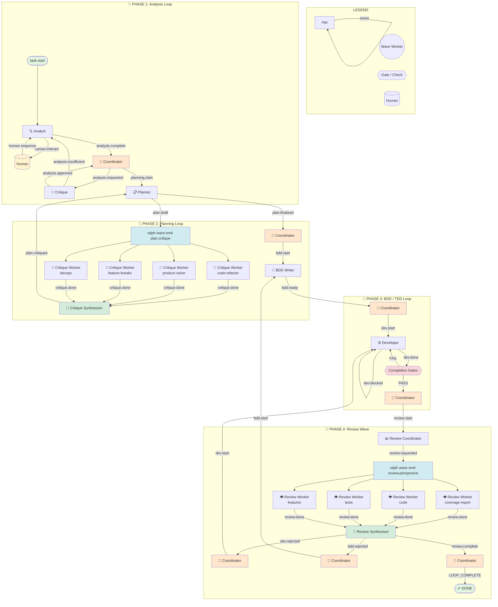

# Enterprise Dev Pipeline — Visual Graph

## Event Flow Table

| From | Event | To | Notes |
|------|-------|-----|-------|
| Loop | `task.start` | Analyst | Kickoff |
| Analyst | `human.interact` | Human | Blocking question |
| Human | `human.response` | Analyst | Continues analysis |
| Analyst | `analysis.complete` | Coordinator | Hand off to hub |
| Coordinator | `analysis.requested` | Critique | Route to critique |
| Critique | `analysis.insufficient` | Analyst | **Loop back** for more evidence |
| Critique | `analysis.approved` | Coordinator | Return to hub |
| Coordinator | `planning.start` | Planner | Route to planning |
| Planner | `plan.draft` | Wave Dispatch | Emit 4 critique perspectives |
| Critique Workers | `critique.done` | Critique Synthesizer | Aggregate waits for all 4 |
| Synthesizer | `plan.critiqued` | Planner | **Loop back** for revision |
| Planner | `plan.finalized` | Coordinator | Hand off to hub |
| Coordinator | `bdd.start` | BDD Writer | Route to BDD |
| BDD Writer | `bdd.ready` | Coordinator | Hand off to hub |
| Coordinator | `dev.start` | Developer | Route to development |
| Developer | `dev.done` | Completion Gates | Tests + coverage enforced |
| Gates | *(backpressure)* | Developer | **Loop back** if fail |
| Gates | *(pass)* | Coordinator | Return to hub |
| Coordinator | `review.start` | Review Coordinator | Route to review |
| Review Coordinator | `review.requested` | Wave Dispatch | Emit 4 review perspectives |
| Review Workers | `review.done` | Review Synthesizer | Aggregate waits for all 4 |
| Synthesizer | `dev.rejected` | Coordinator → Developer | **Loop back** code fixes |
| Synthesizer | `bdd.rejected` | Coordinator → BDD Writer | **Loop back** test fixes |
| Synthesizer | `review.complete` | Coordinator | Return to hub |
| Coordinator | `LOOP_COMPLETE` | — | Terminate loop |

## Loops Summary

| Loop | Hats Involved | Trigger |
|------|--------------|---------|
| **Analysis Loop** | Analyst ↔ Critique | `analysis.insufficient` |
| **Planning Loop** | Planner ↔ Critique Wave → Synthesizer | `plan.critiqued` |
| **TDD Loop** | Developer → Gates | Gate failure (backpressure) |
| **Review→Dev Loop** | Review Synthesizer → Coordinator → Developer | `dev.rejected` |
| **Review→BDD Loop** | Review Synthesizer → Coordinator → BDD Writer | `bdd.rejected` |

## Waves Summary

| Wave | Coordinator | Workers | Topic | Result |
|------|------------|---------|-------|--------|
| **Plan Critique** | Planner | 4 Critique Workers | `plan.critique` | `critique.done` → Synthesizer |
| **Quality Review** | Review Coordinator | 4 Review Workers | `review.perspective` | `review.done` → Synthesizer |

## Coordinator Routing Table

| Incoming Event | Outgoing Event | Target Hat |
|---------------|---------------|-----------|
| `analysis.complete` | `analysis.requested` | Critique |
| `analysis.approved` | `planning.start` | Planner |
| `plan.finalized` | `bdd.start` | BDD Writer |
| `bdd.ready` | `dev.start` | Developer |
| `dev.done` (gates pass) | `review.start` | Review Coordinator |
| `dev.rejected` | `dev.start` | Developer |
| `bdd.rejected` | `bdd.start` | BDD Writer |
| `review.complete` | `LOOP_COMPLETE` | Loop termination |
