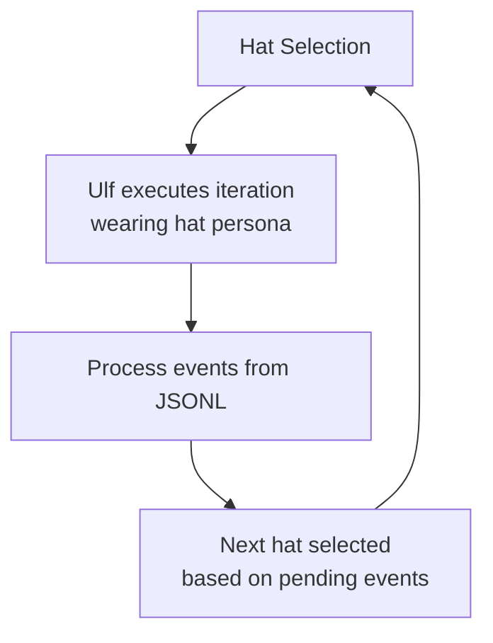
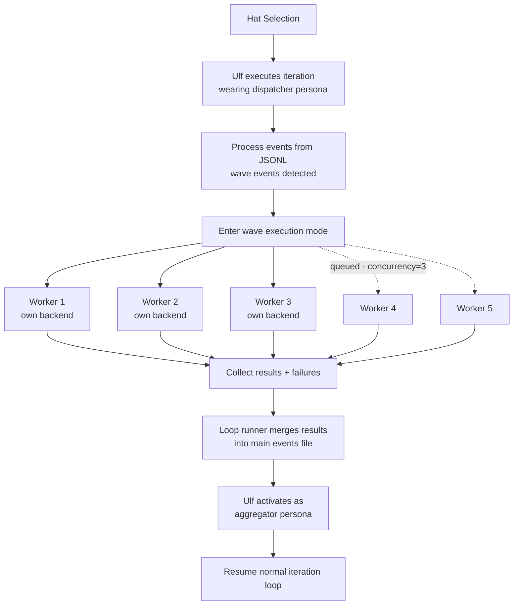
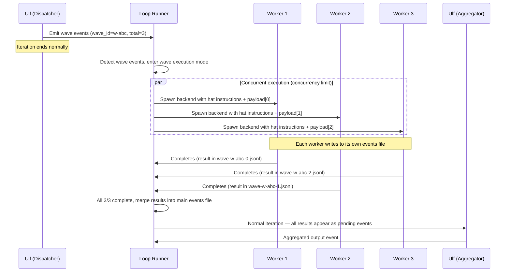
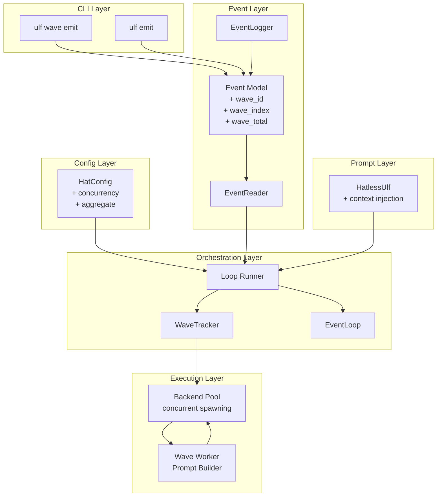

# Agent Waves: Design Document

## Overview

Agent Waves introduce intra-loop parallelism to Ulf's orchestration loop. Today, Ulf executes one hat per iteration, sequentially. Waves allow a dispatcher hat to fan out work to multiple concurrent backend instances, collect results, and aggregate them — all within a single orchestration run.

This is a general-purpose parallel execution primitive. Use cases include deep research (parallel topic exploration), multi-perspective analysis, parallel code review, scatter-gather for any domain, and multi-agent debate patterns.

Waves are built on three primitives inspired by Enterprise Integration Patterns:
1. **Wave-aware event emission** — events tagged with correlation metadata
2. **Concurrent hat execution** — the loop runner spawns multiple backends in parallel
3. **Aggregator gate** — a hat that buffers results and activates only when all correlated results arrive

Source: https://github.com/mikeyobrien/ulf-orchestrator/issues/210

### Why not just spawn subagents?

An agent could spawn N backends in a single step and collect results — no new infrastructure needed. Waves add value in two specific ways:

1. **Wall-clock time.** This is the primary motivation. 5 file reviews at 2 minutes each: sequential is 10 minutes, concurrent is 2. For multi-hat presets, sequential execution is the dominant bottleneck. Waves eliminate it.

2. **Fresh context for synthesis.** When N workers each produce substantial output, an in-context approach forces the dispatching agent to hold all results in one context window. Waves route results to a dedicated aggregator hat that activates in a fresh iteration — purpose-built instructions, no context pressure from the dispatch phase.

The concurrent execution is the real value. The event plumbing (per-worker files, env vars, correlation metadata) is what makes it work correctly within Ulf's existing architecture.

---

## Architectural Impact

Today, `next_hat()` always returns "ulf" in multi-hat mode. Custom hats never get their own backend process — they are personas that Ulf wears during coordination. Wave workers are the **first case where hats execute directly** with their own backend process, outside Ulf's coordination context.

This is a deliberate, bounded exception to the Hatless Ulf model:

- **Why it's safe**: Wave workers have no coordination role. They receive a single task payload, execute with their hat's instructions, emit a result event, and exit. They cannot emit waves (hard-blocked via env var), have no access to Ulf's HATS table, scratchpad, or objective, and cannot influence hat selection.
- **What's preserved**: Ulf still owns all coordination — hat selection, event routing, aggregation, and loop control. The loop runner manages the wave lifecycle entirely; the event loop remains wave-agnostic.
- **Bounded scope**: Workers are structurally isolated. Each gets a per-worker events file, a fresh backend process, and env vars that identify it as a wave worker. The loop runner collects results and merges them back into the main event stream only after the wave completes.

---

## Detailed Requirements

### Core Architecture (from requirements clarification)

| Decision | Choice | Rationale |
|----------|--------|-----------|
| Execution model | Ulf dispatches, loop runner executes (Q1:B) | Preserves Hatless Ulf — Ulf decides WHAT to parallelize, loop runner handles HOW |
| Instance capability | Full hat execution, no nested waves (Q2:A) | Agents are smart; let them do the work. Guardrails are structural, not capability-based |
| Aggregation | Ulf as aggregator with `wait_for_all` gate (Q3:A) | Aggregator is just another hat. Only new thing is the gate |
| Dispatch mechanism | CLI tools + context injection for NL dispatch (Q4:C) | Same mechanism — CLI tools are the plumbing, context injection enables adaptive dispatch |
| Isolation | Shared workspace only (Q5:A) | Zero overhead, sufficient for read-heavy/write-disjoint workloads |
| Failure handling | Best-effort, hardcoded (Q6:B) | Wave continues on failure. Aggregator gets partial results + failure metadata |
| Cost accounting | Each instance = one activation (Q7:A) | Transparent. Existing limits (`max_activations`, `max_cost`) constrain wave size naturally |
| Aggregation timeout | 300s default, overridable (Q8:B) | Prevents hung waves. Aggregator fires with partial results on timeout |

### v1 Scope

**Included:**
- Wave CLI tool (`ulf wave emit` — atomic batch emission)
- Event correlation metadata (`wave_id`, `wave_index`, `wave_total`)
- Concurrent backend spawning in loop runner (respecting `concurrency` limit)
- `aggregate.mode: wait_for_all` with configurable timeout (default 300s)
- Context injection (downstream hat descriptions in prompt for NL dispatch)
- Best-effort failure handling with structured failure metadata
- Per-instance activation and cost accounting
- Per-worker events files (merged by loop runner after collection)
- Worker env var injection (`ULF_WAVE_WORKER`, `ULF_WAVE_ID`, `ULF_WAVE_INDEX`, `ULF_EVENTS_FILE`)
- Shared workspace (no filesystem isolation)
- No nested waves

**Deferred to v2+:**
- `ulf wave start`/`ulf wave end` (incremental wave emission)
- Nested waves
- Additional aggregation modes (`first_n`, `quorum`, `external_event`)
- Configurable failure modes (`on_failure: fail_fast`)
- Wave-level cost limits
- Dedicated aggregator backends
- Multi-round debate optimizations

---

## Architecture Overview

### Normal Iteration



### Wave Iteration



### Wave Lifecycle



### Component Interaction



---

## Components and Interfaces

### 1. Event Model Extensions

**File:** `crates/ulf-proto/src/event.rs`

Add optional wave metadata to the `Event` struct:

```rust
pub struct Event {
    pub topic: Topic,
    pub payload: String,
    pub source: Option<HatId>,
    pub target: Option<HatId>,
    // New wave fields
    pub wave_id: Option<String>,
    pub wave_index: Option<u32>,
    pub wave_total: Option<u32>,
}
```

Builder methods:
```rust
impl Event {
    pub fn with_wave(mut self, wave_id: String, index: u32, total: u32) -> Self {
        self.wave_id = Some(wave_id);
        self.wave_index = Some(index);
        self.wave_total = Some(total);
        self
    }

    pub fn is_wave_event(&self) -> bool {
        self.wave_id.is_some()
    }
}
```

**File:** `crates/ulf-core/src/event_logger.rs`

Extend `EventRecord` with optional wave fields:

```rust
pub struct EventRecord {
    // ... existing fields ...
    #[serde(skip_serializing_if = "Option::is_none")]
    pub wave_id: Option<String>,
    #[serde(skip_serializing_if = "Option::is_none")]
    pub wave_index: Option<u32>,
    #[serde(skip_serializing_if = "Option::is_none")]
    pub wave_total: Option<u32>,
}
```

**File:** `crates/ulf-core/src/event_reader.rs`

Update the JSONL deserializer to parse wave fields. Use `#[serde(default)]` so existing events without wave fields parse correctly. The existing `deserialize_flexible_payload` function handles string/object/null payloads — no changes needed there, but the `Event` struct in `event_reader.rs` (distinct from `ulf-proto`'s `Event`) must gain the optional wave fields.

### 2. HatConfig Extensions

**File:** `crates/ulf-core/src/config.rs`

```rust
pub struct HatConfig {
    // ... existing fields ...
    /// Maximum concurrent instances when processing wave events.
    /// Default: 1 (sequential, current behavior).
    #[serde(default = "default_concurrency")]
    pub concurrency: u32,
    /// Aggregation configuration. When set, this hat buffers incoming
    /// wave-correlated events and only activates once all results arrive.
    #[serde(default)]
    pub aggregate: Option<AggregateConfig>,
}

fn default_concurrency() -> u32 { 1 }

#[derive(Debug, Clone, Serialize, Deserialize)]
pub struct AggregateConfig {
    /// Aggregation mode. v1 only supports `wait_for_all`.
    pub mode: AggregateMode,
    /// Timeout in seconds. Aggregator activates with partial results
    /// if not all wave results arrive within this duration.
    /// Default: 300 seconds.
    #[serde(default = "default_aggregate_timeout")]
    pub timeout: u32,
}

fn default_aggregate_timeout() -> u32 { 300 }

#[derive(Debug, Clone, Serialize, Deserialize)]
#[serde(rename_all = "snake_case")]
pub enum AggregateMode {
    WaitForAll,
}
```

**Validation** (in `UlfConfig::validate()`):
- `concurrency` must be >= 1
- If `aggregate` is set, `mode` must be `wait_for_all`
- Warn if `concurrency` > 1 but no downstream hat has `aggregate` configured (likely misconfiguration)
- Error if `aggregate` is set on a hat that also has `concurrency` > 1 (an aggregator shouldn't be a concurrent worker)

### 3. WaveTracker

**New file:** `crates/ulf-core/src/wave_tracker.rs`

Central state machine for tracking active waves.

```rust
pub struct WaveTracker {
    active_waves: HashMap<String, WaveState>,
}

pub struct WaveState {
    pub wave_id: String,
    pub expected_total: u32,
    pub source_hat: HatId,           // dispatcher hat
    pub worker_hat: HatId,           // hat that processes wave events
    pub result_topic: Option<Topic>, // topic workers publish to
    pub dispatched: Vec<WaveInstance>,
    pub results: Vec<WaveResult>,
    pub failures: Vec<WaveFailure>,
    pub started_at: Instant,
    pub timeout: Duration,
}

pub struct WaveInstance {
    pub index: u32,
    pub event: Event,              // the original wave event
    pub status: InstanceStatus,
}

pub enum InstanceStatus {
    Queued,
    Running,
    Completed,
    Failed(String),                // error message
    TimedOut,
}

pub struct WaveResult {
    pub index: u32,
    pub event: Event,              // the result event from worker
}

pub struct WaveFailure {
    pub index: u32,
    pub error: String,
    pub duration: Duration,
}

impl WaveTracker {
    pub fn new() -> Self;

    /// Register a new wave from detected wave events.
    pub fn register_wave(&mut self, wave_id: String, events: Vec<Event>,
                         worker_hat: HatId, timeout: Duration) -> &WaveState;

    /// Record a result event for a wave.
    pub fn record_result(&mut self, wave_id: &str, event: Event) -> WaveProgress;

    /// Record a failure for a wave instance.
    pub fn record_failure(&mut self, wave_id: &str, index: u32,
                          error: String, duration: Duration);

    /// Check if a wave is complete (all results or timeout).
    pub fn is_complete(&self, wave_id: &str) -> bool;

    /// Check for timed-out waves. Returns wave IDs that have timed out.
    pub fn check_timeouts(&mut self) -> Vec<String>;

    /// Get all results and failures for a completed wave.
    pub fn take_wave_results(&mut self, wave_id: &str) -> Option<CompletedWave>;

    /// Check if any wave is currently active.
    pub fn has_active_waves(&self) -> bool;
}

pub struct CompletedWave {
    pub wave_id: String,
    pub results: Vec<WaveResult>,
    pub failures: Vec<WaveFailure>,
    pub timed_out: bool,
    pub duration: Duration,
}

pub enum WaveProgress {
    /// More results expected.
    InProgress { received: u32, expected: u32 },
    /// All results received, wave complete.
    Complete,
}
```

### 4. Wave CLI Tool

**New file:** `crates/ulf-cli/src/wave.rs`

Top-level command (like `ulf emit`):

```rust
#[derive(Parser, Debug)]
pub struct WaveArgs {
    #[command(subcommand)]
    pub command: WaveCommands,
}

#[derive(Subcommand, Debug)]
pub enum WaveCommands {
    /// Batch emit: generate wave ID, emit N events atomically.
    Emit(WaveBatchEmitArgs),
}

#[derive(Parser, Debug)]
pub struct WaveBatchEmitArgs {
    /// Event topic for all wave events.
    pub topic: String,
    /// Payloads for each wave event.
    #[arg(long, num_args = 1..)]
    pub payloads: Vec<String>,
}
```

**`ulf wave emit <topic> --payloads "a" "b" "c"`:**
Atomic batch emission — no state file needed:
1. Check `ULF_WAVE_WORKER` env var — if set, exit with error (nested wave prevention)
2. Generate wave ID (timestamp-based hex: `w-{:08x}` from nanos mod `0xFFFF_FFFF`)
3. Resolve events file from `.ulf/current-events` marker (falling back to `.ulf/events.jsonl`)
4. Write N events to JSONL, each with `wave_id`, `wave_index: 0..N-1`, `wave_total: N`
5. Print wave ID to stdout

v1 only supports batch emission. Incremental emission (`ulf wave start`/`ulf wave end`) is deferred to v2 — the batch command covers the common case and avoids state file complexity.

**`ulf emit` (unchanged):**
No modifications to `ulf emit` in v1. When a wave worker needs to emit result events, the worker's env vars (`ULF_WAVE_ID`, `ULF_WAVE_INDEX`) are read by `ulf emit` to auto-tag the event with wave correlation metadata. The worker's `ULF_EVENTS_FILE` env var directs output to its per-worker events file.

```rust
// In emit_command():
fn resolve_wave_metadata() -> Option<(String, u32)> {
    let wave_id = std::env::var("ULF_WAVE_ID").ok()?;
    let wave_index = std::env::var("ULF_WAVE_INDEX").ok()?.parse().ok()?;
    Some((wave_id, wave_index))
}

fn resolve_events_file(args: &EmitArgs) -> PathBuf {
    // 1. ULF_EVENTS_FILE env var (set for wave workers)
    // 2. .ulf/current-events marker (existing behavior)
    // 3. args.file fallback (existing behavior)
    if let Ok(path) = std::env::var("ULF_EVENTS_FILE") {
        return PathBuf::from(path);
    }
    // ... existing resolution logic ...
}
```

When wave metadata is present, the emitted event includes `wave_id` and `wave_index` fields. `wave_total` is omitted on worker result events (the loop runner already knows the expected total from the dispatch events).

### 5. Loop Runner Changes

**File:** `crates/ulf-cli/src/loop_runner.rs`

The main loop gains a new execution phase after processing events from a normal iteration. The loop runner **owns the entire wave lifecycle** — the event loop remains wave-agnostic.

```
Main loop iteration:
  1. Hat selection → Ulf (dispatcher persona)
  2. Build prompt → include HATS table with downstream descriptions
  3. Execute backend → Ulf runs, emits wave events via CLI
  4. Process output
  5. Read events from JSONL
  6. *** NEW: Detect wave events ***
  7. If wave events detected:
     a. Separate wave events from non-wave events
     b. Resolve target hat from wave event topics (via hat registry)
     c. Create per-worker events files (.ulf/wave-{wave_id}-{index}.jsonl)
     d. Spawn concurrent backends (up to concurrency limit)
     e. Collect results with aggregate timeout
     f. Read result events from each per-worker events file
     g. Merge all results into the main events file
     h. Clean up per-worker files
     i. Increment worker hat's activation count by number of instances
  8. Continue normal loop (aggregator hat sees all results as pending events)
```

**Wave detection** (after `process_events_from_jsonl()`):
```rust
pub struct DetectedWave {
    pub wave_id: String,
    pub target_hat: HatId,           // resolved from topic → hat mapping
    pub hat_config: HatConfig,       // the worker hat's config
    pub events: Vec<Event>,          // the individual wave events
    pub total: u32,                  // expected total (from wave_total field)
}

fn detect_wave_events(
    events: &[Event],
    registry: &HatRegistry,
) -> Option<DetectedWave> {
    // Group events by wave_id
    // Validate: all events in a wave_id have consistent wave_total
    // Resolve target hat from event topic via registry
    // Return wave metadata + events
}
```

**Concurrent backend spawning:**
```rust
async fn execute_wave(
    &mut self,
    wave: DetectedWave,
    backend: &CliBackend,
) -> Result<CompletedWave> {
    let semaphore = Arc::new(Semaphore::new(wave.hat_config.concurrency as usize));
    let mut handles = Vec::new();

    for (index, event) in wave.events.iter().enumerate() {
        // Create per-worker events file
        let worker_events_file = self.ulf_dir
            .join(format!("wave-{}-{}.jsonl", wave.wave_id, index));

        let permit = semaphore.clone().acquire_owned().await?;
        let handle = tokio::spawn(async move {
            let result = execute_wave_instance(
                event, &wave.hat_config, backend,
                &worker_events_file, &wave.wave_id, index as u32,
            ).await;
            drop(permit); // release concurrency slot
            result
        });
        handles.push(handle);
    }

    // Collect all results (with aggregate timeout from downstream aggregator config)
    let timeout = self.resolve_aggregate_timeout(&wave);
    let results = tokio::time::timeout(timeout,
        futures::future::join_all(handles)
    ).await;

    // On timeout: cancel running instances (SIGTERM, then SIGKILL after 250ms)
    // Merge results from per-worker files into main events file
    // Clean up per-worker files
    // Return CompletedWave with results, failures, cost data
}
```

**Wave instance execution:**
Each wave instance gets:
- A fresh backend process (ACP or PTY, matching the worker hat's backend config)
- The worker hat's instructions as system context
- The specific wave event payload as the prompt/task
- Full tool access (same as normal hat execution)
- No Ulf coordination context (no HATS table, no scratchpad, no objective)
- Environment variables for wave context and isolation:

```rust
fn build_wave_instance_env(
    wave_id: &str,
    index: u32,
    worker_events_file: &Path,
) -> Vec<(String, String)> {
    vec![
        ("ULF_WAVE_WORKER".into(), "1".into()),
        ("ULF_WAVE_ID".into(), wave_id.into()),
        ("ULF_WAVE_INDEX".into(), index.to_string()),
        ("ULF_EVENTS_FILE".into(), worker_events_file.display().to_string()),
    ]
}
```

These env vars are set on the spawned backend process and serve three purposes:
1. `ULF_WAVE_WORKER` — hard-blocks nested `ulf wave emit` calls
2. `ULF_WAVE_ID` + `ULF_WAVE_INDEX` — auto-tags events emitted by `ulf emit` with wave correlation metadata
3. `ULF_EVENTS_FILE` — directs `ulf emit` output to the per-worker events file, avoiding concurrent writes to the main events file

**Cost tracking:**
Each `WaveInstanceResult` includes cost and token data extracted from the backend output:

```rust
pub struct WaveInstanceResult {
    pub index: u32,
    pub status: InstanceStatus,
    pub events: Vec<Event>,          // parsed from per-worker events file
    pub cost: f64,                   // API cost for this instance
    pub tokens: u64,                 // token usage for this instance
    pub duration: Duration,
}
```

The loop runner accumulates costs across all instances and feeds them into the global `max_cost` check. Each instance counts as one activation against the worker hat's `max_activations`.

### 6. Wave Worker Prompt Builder

**New file:** `crates/ulf-core/src/wave_prompt.rs`

Builds the prompt for a wave worker instance. Simpler than Ulf's full prompt:

```rust
pub fn build_wave_worker_prompt(
    hat_config: &HatConfig,
    event: &Event,
    wave_context: &WaveWorkerContext,
) -> String {
    // Sections:
    // 1. Hat instructions (from hat config)
    // 2. Wave context metadata (wave_id, index, total)
    // 3. Event payload (the specific work item)
    // 4. Event writing guide (how to emit result events)
    // 5. Nested wave guard ("Do NOT use `ulf wave` commands")
}
```

```rust
pub struct WaveWorkerContext {
    pub wave_id: String,
    pub wave_index: u32,
    pub wave_total: u32,
    pub result_topics: Vec<String>,   // from hat's `publishes`
}
```

The worker's events file path and wave metadata are communicated via env vars (see Section 5), not embedded in the prompt. The prompt only includes what the agent needs to understand its task — the env vars handle the plumbing transparently.

### 7. Context Injection for NL Dispatch

**File:** `crates/ulf-core/src/hatless_ulf.rs`

Enhance the existing HATS table generation to include richer downstream context. When building the prompt for a hat that has `publishes` topics:

**Current behavior** (partially exists):
```
| Hat | Triggers On | Publishes | Description |
```

**Enhanced for waves:**
```
## Available Downstream Hats

When you emit events, they activate downstream hats. Use `ulf wave`
tools to fan out work in parallel.

| Topic | Activates | Description | Concurrent |
|-------|-----------|-------------|------------|
| review.security | Security Reviewer | Reviews for vulnerabilities, injection, auth bypass | up to 3 |
| review.perf | Perf Reviewer | Reviews hot paths, allocations, N+1 queries | up to 3 |
| review.maintain | Maintainability Reviewer | Reviews clarity, naming, duplication, coverage | up to 3 |

Emit multiple events as a wave to process them in parallel:
  ulf wave emit <topic> --payloads "<payload1>" "<payload2>" ...
```

This context is injected only when:
- The active hat has `publishes` that target wave-capable hats (`concurrency > 1`)
- OR the active hat has `publishes` that target multiple different hats (scatter-gather pattern)

### 8. Aggregator Gate

**Owned by:** the loop runner (`crates/ulf-cli/src/loop_runner.rs`)

The aggregator gate is implicit in the loop runner's wave lifecycle. The loop runner collects **all** wave results (or times out), then writes them to the main events file in a single batch. The event loop never sees partial wave results — by the time it processes events on the next iteration, all results are present.

This means:
- No changes to `event_loop/mod.rs` for gating
- No `should_activate_hat()` needed — the event loop's existing `determine_active_hats()` naturally picks up the aggregator hat because all its pending events appear at once
- The `aggregate` config on the hat is used only by the **loop runner** to determine timeout duration
- The `aggregate.mode: wait_for_all` is the loop runner's collection strategy, not an event loop filter

When all results are merged, Ulf activates as the aggregator persona and sees them as pending events in a single prompt:

```
## PENDING EVENTS

Wave results (wave_id: w-abc123, 5/5 complete):

[0] review.result from Security Reviewer:
  Found SQL injection risk in src/db.rs:42...

[1] review.result from Perf Reviewer:
  N+1 query detected in src/api/users.rs:18...

[2] review.result from Maintainability Reviewer:
  Function `process_all` exceeds 200 lines...

[3] review.result (FAILED - instance timeout after 300s)

[4] review.result from API Reviewer:
  Breaking change: removed `user_id` field from response...
```

### 9. Nested Wave Prevention

Wave worker instances must not emit further waves. Enforced at two levels:

**Soft enforcement (prompt):** Wave worker prompts include:
```
IMPORTANT: Do NOT use `ulf wave start`, `ulf wave end`, or
`ulf wave emit` commands. You are a wave worker instance —
nested waves are not supported.
```

**Hard enforcement (CLI):** `ulf wave emit` checks for the `ULF_WAVE_WORKER` environment variable set by the loop runner on all wave worker processes:
```rust
if std::env::var("ULF_WAVE_WORKER").is_ok() {
    eprintln!("Error: nested waves are not supported. This instance is already a wave worker.");
    std::process::exit(1);
}
```

---

## Data Models

### Wave Event (JSONL format)

Emitted by dispatcher (written to main events file):
```json
{
  "topic": "review.file",
  "payload": "src/main.rs",
  "ts": "2026-02-28T10:00:00Z",
  "wave_id": "w-a3f7b2c1",
  "wave_index": 0,
  "wave_total": 5
}
```

Emitted by worker (written to per-worker events file, e.g., `.ulf/wave-w-a3f7b2c1-0.jsonl`):
```json
{
  "topic": "review.result",
  "payload": "Found SQL injection risk in...",
  "ts": "2026-02-28T10:01:23Z",
  "wave_id": "w-a3f7b2c1",
  "wave_index": 0
}
```

The `wave_id` and `wave_index` are auto-tagged by `ulf emit` from the `ULF_WAVE_ID` and `ULF_WAVE_INDEX` env vars. `wave_total` is omitted on worker events — the loop runner already knows the expected total from the dispatch events.

### Hat Config (YAML)

```yaml
hats:
  dispatcher:
    name: "Research Dispatcher"
    description: "Identifies research topics and fans out parallel investigation"
    triggers: ["research.start"]
    publishes: ["research.topic"]
    instructions: |
      Analyze the research question and identify distinct topics
      to investigate in parallel. Fan out to researchers.

  researcher:
    name: "Deep Researcher"
    description: "Investigates a specific topic using web search and code analysis"
    triggers: ["research.topic"]
    publishes: ["research.finding"]
    concurrency: 5
    instructions: |
      You are researching a specific topic. Use all available tools
      to gather comprehensive information. Emit research.finding
      with your analysis.

  synthesizer:
    name: "Research Synthesizer"
    description: "Combines parallel research findings into a coherent report"
    triggers: ["research.finding"]
    publishes: ["research.complete"]
    aggregate:
      mode: wait_for_all
      timeout: 600
    instructions: |
      You have received findings from parallel research agents.
      Synthesize into a coherent report, noting areas of agreement,
      contradiction, and gaps.
```

### Completed Wave (internal)

Returned by `execute_wave()` in the loop runner. Cost and token fields are accumulated from individual `WaveInstanceResult` structs (see Section 5).

```rust
pub struct CompletedWave {
    pub wave_id: String,
    pub results: Vec<WaveResult>,      // successful results
    pub failures: Vec<WaveFailure>,    // failed/timed-out instances
    pub timed_out: bool,               // did the aggregate timeout fire?
    pub duration: Duration,            // total wall-clock time
    pub total_cost: f64,               // accumulated API cost
    pub total_tokens: u64,             // accumulated token usage
}
```

---

## Error Handling

### Instance Failures (Best-Effort)

When a wave instance fails:
1. The failure is recorded in `WaveTracker` with error message and duration
2. The wave continues — other instances are unaffected
3. When the aggregator activates, failures appear as structured metadata in the prompt
4. The aggregator's instructions determine how to handle partial results

Failure types:
- **Backend error** — API returned an error (rate limit, server error)
- **Timeout** — instance exceeded the aggregate timeout (the aggregate timeout from the downstream aggregator hat's config applies to the entire wave; there is no separate per-instance timeout in v1)
- **Crash** — backend process exited unexpectedly
- **Scope violation** — instance emitted an event outside its `publishes` whitelist

### Aggregation Timeout

When `aggregate.timeout` fires:
1. All running instances are cancelled (SIGTERM, then SIGKILL after 250ms)
2. Aggregator activates with all results received so far
3. Missing instances appear as `status: timeout` in the failure metadata
4. A `diag.wave.timeout` event is logged to diagnostics (not published to the EventBus, to avoid accidental hat triggering)

### Nested Wave Attempt

Hard-blocked via `ULF_WAVE_WORKER` env var check. CLI exits with error, no event emitted. The wave instance's iteration counts as a failure.

### Invalid Wave Configuration

Caught at config validation time:
- `concurrency: 0` → error
- `aggregate` on a hat with `concurrency > 1` → error (aggregator shouldn't be a concurrent worker)
- `aggregate.timeout: 0` → error

### Malformed Wave Events

If wave events have inconsistent metadata (e.g., different `wave_total` values for the same `wave_id`):
- Log warning to diagnostics
- Use the maximum `wave_total` seen
- Continue processing (don't fail the wave)

### Wave with Zero Results

If all instances fail or timeout:
- Aggregator still activates with empty results + all failures
- Aggregator can decide to retry, report failure, or take alternative action

---

## Relationship to Parallel Loops

Ulf has an existing parallel loops feature that runs independent orchestration loops in git worktrees. Waves and parallel loops are complementary, not overlapping — they solve different problems at different granularities.

| Dimension | Parallel Loops (existing) | Agent Waves |
|-----------|--------------------------|-------------|
| **Granularity** | Entire orchestration runs | Single hat activations within a run |
| **Initiated by** | User (CLI: `ulf run -p "..."`) | Ulf (NL dispatch / `ulf wave emit`) |
| **What runs** | Full hat sequence (Ulf picks hats) | Specific hat with specific payload |
| **Isolation** | Always git worktree (separate branch) | Shared workspace |
| **On completion** | Merge queue → merge-ulf | Aggregator hat fires when all results arrive |
| **Lifecycle** | Minutes to hours | Seconds to minutes |
| **Configuration** | `features.parallel: true` (orchestrator-level) | `concurrency` / `aggregate` (hat-level) |

### Why not combine them?

Worktree isolation in parallel loops is load-bearing — independent orchestration runs write to overlapping files, run conflicting builds, and need separate git branches. Removing worktrees would introduce concurrent write races with no coordination mechanism.

Waves fill the lightweight case: intra-loop fan-out where instances are read-heavy or write-disjoint. The dispatcher controls what each worker sees, and shared workspace has zero overhead.

A "parallel loops without worktrees" option would give the danger of shared-workspace concurrent writes without the guardrails waves provide (targeted single-hat activations, aggregation, Ulf deciding what's safe to parallelize).

### Worktree isolation is not needed for v1

v1 waves use shared workspace only — zero overhead, sufficient for read-heavy and write-disjoint workloads. Parallel loops cover the write-heavy case today.

### Future: `isolation: worktree` could unify both features

If waves gained per-hat worktree isolation (`isolation: worktree`), they could subsume parallel loops entirely. A wave worker running in its own worktree with its own git branch is functionally equivalent to a parallel loop — the only difference is orchestration model (parent-child vs peer-to-peer).

The core insight: parallel loops aren't really a parallelism feature — they're a **filesystem isolation feature** that happens to enable parallelism. The actual parallelism primitive is waves. If waves can optionally isolate at the filesystem level, the separate parallel loops system becomes redundant.

```yaml
# Future: wave worker with worktree isolation
hats:
  implementer:
    triggers: ["task.implement"]
    publishes: ["task.done"]
    concurrency: 3
    isolation: worktree    # each instance gets its own worktree + branch
    instructions: |
      Implement the assigned task. Commit your changes.
```

This is deferred until waves prove out in practice. The migration path would be: ship waves v1 (shared workspace) → validate the orchestration model → add `isolation: worktree` → deprecate parallel loops as a separate feature.

The remaining gap is ad-hoc user initiation (`ulf run` in a second terminal). This could be addressed with something like `ulf run -p "task" --join <loop-id>` to attach as a wave instance to an existing loop, but that's a UX question for later.

---

## Example Configurations

### Scatter-Gather: Specialized Code Review

Four specialized reviewers run concurrently, each examining the PR from a different angle. The dispatcher tailors context per reviewer so each gets only relevant files. The synthesizer waits for all findings before producing a unified review.

Note: `concurrency: 1` on each reviewer doesn't mean sequential — different hats run concurrently by default in wave mode. The `concurrency` field controls instances of the *same* hat. Four hats with `concurrency: 1` = four parallel workers.

```yaml
hats:
  review-dispatcher:
    name: "Review Dispatcher"
    description: "Reads the PR diff and dispatches to specialized reviewers"
    triggers: ["review.start"]
    publishes: ["review.security", "review.perf", "review.arch", "review.correctness"]
    instructions: |
      Read the PR diff. For each reviewer, emit an event with ONLY the
      files and context relevant to their specialty. Don't send everything
      to everyone — tailor the payload.

  security-reviewer:
    name: "Security Reviewer"
    description: "Reviews code for security vulnerabilities"
    triggers: ["review.security"]
    publishes: ["review.finding"]
    concurrency: 1
    instructions: |
      ONLY look for: injection, auth flaws, secrets in code, unsafe
      deserialization, OWASP top 10. Ignore style and performance.

  perf-reviewer:
    name: "Performance Reviewer"
    description: "Reviews code for performance issues"
    triggers: ["review.perf"]
    publishes: ["review.finding"]
    concurrency: 1
    instructions: |
      ONLY look for: N+1 queries, unbounded allocations, hot path
      inefficiencies, missing indexes, unnecessary clones/copies.

  arch-reviewer:
    name: "Architecture Reviewer"
    description: "Reviews code for architectural concerns"
    triggers: ["review.arch"]
    publishes: ["review.finding"]
    concurrency: 1
    instructions: |
      ONLY look for: coupling, abstraction leaks, violation of existing
      patterns, module boundary crossings, dependency direction.

  correctness-reviewer:
    name: "Correctness Reviewer"
    description: "Reviews code for logic errors and edge cases"
    triggers: ["review.correctness"]
    publishes: ["review.finding"]
    concurrency: 1
    instructions: |
      ONLY look for: logic errors, edge cases, off-by-ones, error
      handling gaps, race conditions, missing null checks.

  review-synthesizer:
    name: "Review Synthesizer"
    description: "Combines findings from all reviewers into a unified review"
    triggers: ["review.finding"]
    publishes: ["review.complete"]
    aggregate:
      mode: wait_for_all
      timeout: 300
    instructions: |
      You have findings from 4 specialized reviewers. Deduplicate where
      reviewers flagged the same issue. Rank by severity. Output a single
      unified review with actionable line-level comments.
```

### Multi-Round Debate: Moderator with Dynamic Participant Selection

A moderator runs up to 3 rounds of structured debate. Each round, the moderator selects which debaters participate based on unresolved disagreements from prior rounds. The moderator controls participation by choosing which events to emit — no special config needed.

Key mechanisms:
- **`max_activations: 4`** is the rounds knob: activation 1 = initial dispatch, activations 2-4 = debate rounds. The moderator is structurally forced to conclude by activation 4.
- **Dynamic selection** is just "which events you emit." Round 1 the moderator emits all 4 debate topics. Round 2 it might only emit `debate.security` and `debate.arch` because the other concerns were resolved.
- **Prior context flows through payloads.** Round 2's payload includes round 1's responses, so debaters can argue with each other.

```yaml
hats:
  moderator:
    name: "Debate Moderator"
    description: "Runs multi-round structured debate with dynamic participant selection"
    triggers: ["debate.start", "debate.response"]
    publishes: ["debate.security", "debate.perf", "debate.arch", "debate.ux", "debate.final"]
    max_activations: 4    # 1 initial dispatch + 3 debate rounds
    aggregate:
      mode: wait_for_all
      timeout: 300
    instructions: |
      You are a debate moderator. You run up to 3 rounds of debate.

      ROUND 1 (first activation, triggered by debate.start):
        Dispatch the topic to ALL debaters. Include the full context.

      ROUNDS 2-3 (subsequent activations, triggered by debate.response):
        Review all responses. Identify:
        - Points of disagreement between debaters
        - Claims that need deeper investigation
        - Perspectives that are missing

        Then SELECTIVELY re-dispatch: only emit events for debaters whose
        expertise is relevant to the unresolved points. Pass prior round
        context in the payload so debaters can respond to each other.

        If consensus reached early, skip remaining rounds and emit debate.final.

      FINAL ACTIVATION (activation 4, or earlier if done):
        Synthesize all rounds into a final verdict. Emit debate.final.

  security-debater:
    name: "Security Debater"
    description: "Argues the security perspective in structured debates"
    triggers: ["debate.security"]
    publishes: ["debate.response"]
    concurrency: 1
    instructions: |
      You are the security perspective. Argue your position based on
      security best practices. If responding to a prior round, directly
      address counterarguments from other debaters.

  perf-debater:
    name: "Performance Debater"
    description: "Argues the performance perspective in structured debates"
    triggers: ["debate.perf"]
    publishes: ["debate.response"]
    concurrency: 1
    instructions: |
      You are the performance perspective. Argue based on runtime cost,
      scalability, and resource efficiency. Acknowledge valid tradeoffs
      raised by other debaters.

  arch-debater:
    name: "Architecture Debater"
    description: "Argues the architecture perspective in structured debates"
    triggers: ["debate.arch"]
    publishes: ["debate.response"]
    concurrency: 1
    instructions: |
      You are the architecture perspective. Argue based on maintainability,
      separation of concerns, and long-term evolution of the codebase.

  ux-debater:
    name: "UX Debater"
    description: "Argues the user experience perspective in structured debates"
    triggers: ["debate.ux"]
    publishes: ["debate.response"]
    concurrency: 1
    instructions: |
      You are the user experience perspective. Argue based on developer
      ergonomics, API clarity, and end-user impact.
```

### Global Concurrency Limit (Not Yet Specified)

The examples above assume a global concurrency limit of 4. Per-hat `concurrency` controls instances of the same hat, but there is no global cap across all concurrent wave workers. A future addition:

```yaml
features:
  max_concurrency: 4    # cap total concurrent wave workers across all hats
```

Without this, a dispatcher fanning out to 4 hats each with `concurrency: 3` could spawn 12 concurrent backends. The global semaphore would be a simple addition to the loop runner alongside the existing per-hat semaphore.

---

## Acceptance Criteria

### Wave Dispatch

```
Given a hat collection with a dispatcher, worker (concurrency: 3), and aggregator
When the dispatcher emits 5 wave events using `ulf wave emit <topic> --payloads ...`
Then the loop runner spawns worker backends with max 3 concurrent
And each worker receives the hat's full instructions plus its specific event payload
And each worker has full tool access
And workers execute to completion, emitting result events
```

### Aggregation Gate

```
Given an aggregator hat with `aggregate: { mode: wait_for_all, timeout: 300 }`
When 5 wave result events arrive with the same wave_id
Then the aggregator activates with all 5 results in a single prompt
And activation counts as 1 activation against the aggregator's max_activations
```

### Partial Results on Timeout

```
Given a wave with 5 expected results and aggregate timeout of 10s
When only 3 results arrive within 10 seconds
Then the aggregator activates with the 3 available results
And the prompt includes structured failure metadata for the 2 missing instances
And running instances are terminated
```

### Best-Effort Failure Handling

```
Given a wave with 5 instances where instance 3 fails with a backend error
When the remaining 4 instances complete successfully
Then the aggregator receives 4 results plus failure metadata for instance 3
And the failed instance counts as 1 activation against the worker hat
```

### Cost Accounting

```
Given a wave with 5 instances, each costing $0.10
When all instances complete
Then total cost reported is $0.50
And the worker hat's activation count increases by 5
And global cost tracking accumulates all instance costs
```

### NL Dispatch (Context Injection)

```
Given a dispatcher hat whose publishes target 3 different wave-capable hats
When Ulf builds the dispatcher's prompt
Then the prompt includes a "Available Downstream Hats" section
And each downstream hat's topic, name, description, and concurrency are listed
And wave emission instructions are included
```

### Nested Wave Prevention

```
Given a wave worker instance (ULF_WAVE_WORKER=1)
When the worker attempts `ulf wave emit`
Then the command fails with an error message
And the worker's iteration counts as a failure
```

### Per-Worker Event Isolation

```
Given a wave with 3 worker instances
When workers emit result events via `ulf emit`
Then each worker writes to its own events file (.ulf/wave-{wave_id}-{index}.jsonl)
And the main events file is not written to during wave execution
And after wave completion the loop runner merges all per-worker results into the main events file
And per-worker files are cleaned up
```

### Backwards Compatibility

```
Given a hat collection with no concurrency or aggregate config
When the orchestration loop runs
Then behavior is identical to pre-wave Ulf (sequential, one hat per iteration)
And events without wave metadata are processed normally
```

### Wave Emission

```
Given an agent running `ulf wave emit research.topic --payloads "AI safety" "quantum computing" "climate modeling"`
When the command executes
Then 3 events are written to the events file
And each has the same wave_id with wave_index 0, 1, 2 and wave_total 3
And the wave_id is printed to stdout
```

---

## Testing Strategy

### Unit Tests (ulf-core, ulf-proto)

- **Event model**: wave metadata serialization/deserialization, backwards compatibility with events missing wave fields
- **WaveTracker**: state machine transitions, timeout detection, result collection, failure recording
- **Config validation**: concurrency bounds, aggregate validation, invalid combinations
- **Wave result merging**: per-worker file reading, main file merging, cleanup
- **Context injection**: downstream hat description generation, wave instruction formatting
- **EventReader**: parsing wave-annotated JSONL, mixed wave/non-wave events

### Integration Tests (ulf-core)

- **Wave lifecycle**: dispatcher emits → workers execute → aggregator collects (using mock backends)
- **Concurrency limiting**: N instances with concurrency M, verify max M concurrent
- **Timeout handling**: wave with slow instances, verify aggregator fires after timeout with partial results
- **Failure propagation**: instance failures recorded, aggregator receives failure metadata
- **Activation accounting**: verify per-instance counting against max_activations
- **Nested wave prevention**: worker attempts `ulf wave emit`, verify hard block

### Smoke Tests (replay-based)

- **End-to-end wave**: recorded JSONL fixture with wave dispatch → worker results → aggregation
- **Scatter-gather**: recorded fixture with multiple different worker hats
- **Partial failure**: recorded fixture with some workers failing

### E2E Tests (ulf-e2e)

- **Mock mode**: full wave lifecycle with mock backend
- **Live mode** (optional): actual API calls for a simple 2-3 instance wave

### CLI Tests

- **`ulf wave emit`**: batch emission produces correct JSONL with wave metadata
- **`ulf emit` with wave env vars**: auto-tags events with `wave_id` and `wave_index`
- **`ulf emit` with `ULF_EVENTS_FILE`**: writes to specified file instead of default
- **`ulf emit` without wave env vars**: unchanged behavior (backwards compatible)
- **Nested prevention**: `ULF_WAVE_WORKER=1 ulf wave emit` fails

---

## Appendices

### A. Technology Choices

| Choice | Rationale |
|--------|-----------|
| `tokio::sync::Semaphore` for concurrency | Already using tokio throughout; semaphore is the standard pattern for limiting concurrent async tasks |
| Timestamp-based wave IDs (`w-{:08x}`) | Simple, collision-resistant within a process; avoids uuid dependency |
| Per-worker events files | Avoids concurrent writes to the main events file; `EventReader` is position-tracking and not concurrent-safe |
| Environment variables for worker context | Transparent plumbing — `ulf emit` reads env vars, workers don't need to know the mechanics |
| Serde optional fields for wave metadata | Backwards compatible; existing events without wave fields parse correctly |

### B. Research Findings

Key findings from codebase research (full details in `research/` directory):

1. **Event system** is file-based (JSONL), not in-process. Events flow: agent CLI → file → EventReader → EventBus. Extension is clean — add optional fields with serde defaults.

2. **Loop runner** is strictly sequential with one backend per iteration. The main loop is a `loop {}` at ~line 788, processing one hat per cycle. Wave execution inserts a new async phase between event processing and the next normal iteration.

3. **Hatless Ulf** is the constant coordinator — `next_hat()` always returns "ulf" in multi-hat mode. Custom hats are personas, not independent executors. Wave workers are the **first case where hats execute directly** with their own backend process, outside Ulf's coordination. See "Architectural Impact" section for why this is safe.

4. **HATS table** already resolves `publishes` → downstream hats with descriptions and Mermaid flowcharts. Context injection for NL dispatch extends this existing mechanism.

5. **Worktree infrastructure** exists for parallel loops but is not needed for waves — waves use shared workspace, and write-heavy parallel work should use parallel loops instead.

### C. Alternative Approaches Considered

| Alternative | Why Rejected |
|-------------|-------------|
| Break Hatless Ulf model entirely (Q1:A) | Creates two execution paths, loses Ulf's coordination coherence |
| Loop-runner-only parallelism (Q1:C) | Kills NL-driven adaptive dispatch, the key differentiator from static config |
| Lightweight wave instances (Q2:B) | Violates "agents are smart, let them do the work" — prescribes capability limits |
| Dedicated aggregator backend (Q3:B) | Premature optimization — Ulf-as-aggregator handles common cases, dedicated backend is v2 |
| Worktree isolation for waves in v1 (Q5:B) | Deferred — not needed for v1. Could eventually unify waves and parallel loops (see "Relationship to Parallel Loops") |
| Fail-fast failure mode (Q6:A) | Partial results are almost always useful; one failure shouldn't waste the whole wave |
| Wave = one activation (Q7:B) | Hides real resource usage from users; breaks max_activations budget contract |

### D. Future Extensions (v2+)

- **Worktree isolation** (`isolation: worktree`): per-wave-instance worktree for write-heavy parallel work. Could unify waves and parallel loops into a single parallelism primitive — see "Relationship to Parallel Loops" section
- **Incremental wave emission**: `ulf wave start`/`ulf wave end` for dynamic wave sizing (when the dispatcher doesn't know the count upfront)
- **Nested waves**: wave workers emitting sub-waves for hierarchical decomposition
- **Additional aggregation modes**: `first_n` (activate after N results), `quorum` (majority), `external_event` (wait for external signal)
- **Configurable failure modes**: `on_failure: fail_fast | best_effort`
- **Dedicated aggregator backends**: separate process for aggregation when result sets are large
- **Wave-level cost limits**: `max_wave_cost` to cap individual wave spend
- **Multi-round debate**: explicit config support for iterative scatter-gather patterns
- **Wave diagnostics dashboard**: real-time wave progress in TUI and web dashboard
